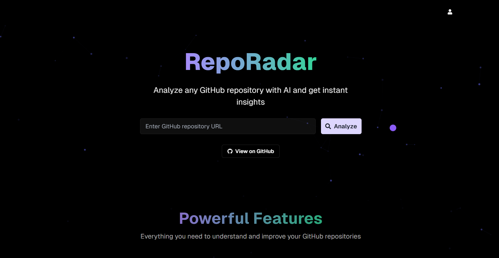
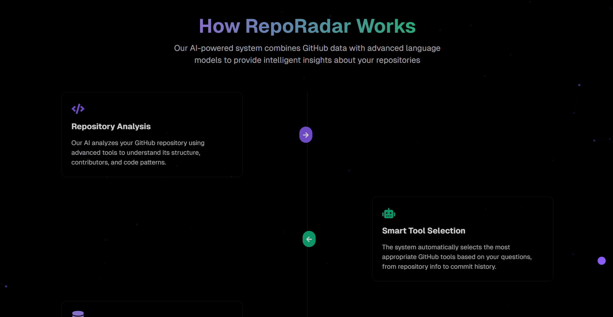
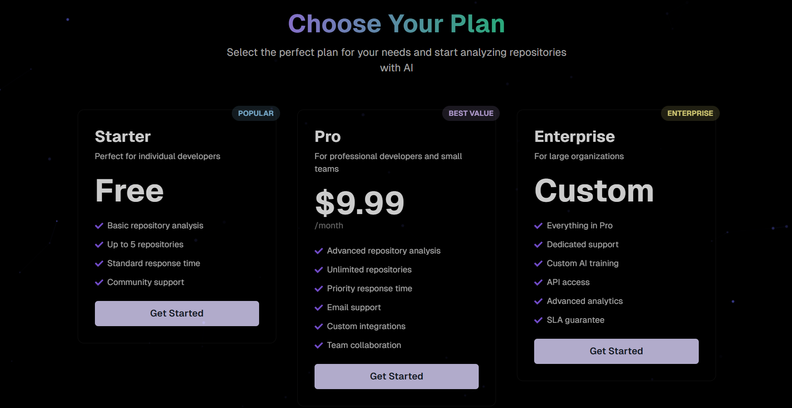
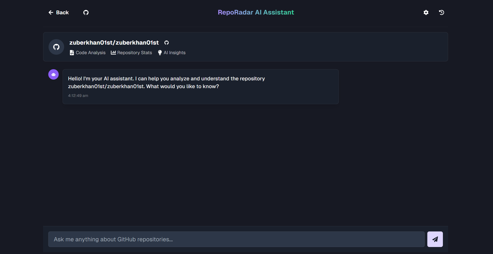

# RepoRadar - AI-Powered GitHub Repository Analysis

<div align="center">
  
  <p><em>RepoRadar's Modern Interface</em></p>
</div>

RepoRadar is an intelligent GitHub repository analysis tool that helps developers understand, explore, and interact with codebases using natural language. Built with Next.js and modern AI capabilities, it provides deep insights into repositories through an intuitive chat interface.

## 🌟 Features

<div align="center">
  
  <p><em>Key Features and Capabilities</em></p>
</div>

- **Natural Language Interaction**: Chat with your repository using plain English
- **Code Analysis**: Get detailed insights about code structure and patterns
- **Smart Recommendations**: Receive AI-powered suggestions for improvements
- **Real-time Analysis**: Instant feedback and analysis of repository changes
- **Interactive UI**: Modern, responsive design with smooth animations

## 🚀 Getting Started

### Prerequisites

- Node.js 18+ 
- npm or yarn
- A GitHub account

### Installation

1. Clone the repository:
```bash
git clone https://github.com/zuberkhan01st/RepoRadar.git
cd RepoRadar
```

2. Install dependencies:
```bash
cd frontend
npm install
```

3. Start the development server:
```bash
npm run dev
```

4. Open [http://localhost:3000](http://localhost:3000) in your browser

## 💡 Usage

<div align="center">
  
  <p><em>Interactive Chat Interface</em></p>
</div>

1. Enter a GitHub repository URL
2. Wait for the initial analysis
3. Start chatting with the AI about the repository
4. Get insights, code explanations, and recommendations

## 🛠️ Technology Stack

- **Frontend**: Next.js 14, React, TypeScript
- **UI Framework**: Chakra UI
- **Animations**: Framer Motion
- **Code Analysis**: Custom AI models
- **Styling**: Tailwind CSS

## 📱 Features in Detail

<div align="center">
  
  <p><em>Advanced Analysis and Insights</em></p>
</div>

### Repository Analysis
- Code structure analysis
- Dependency tracking
- Security vulnerability detection
- Performance metrics

### AI Chat Interface
- Natural language processing
- Context-aware responses
- Code snippet explanations
- Best practice recommendations

### Developer Experience
- Real-time feedback
- Interactive code exploration
- Customizable analysis depth
- Export capabilities

## 🤝 Contributing

Contributions are welcome! Please feel free to submit a Pull Request.

1. Fork the repository
2. Create your feature branch (`git checkout -b feature/AmazingFeature`)
3. Commit your changes (`git commit -m 'Add some AmazingFeature'`)
4. Push to the branch (`git push origin feature/AmazingFeature`)
5. Open a Pull Request

## 📄 License

This project is licensed under the MIT License - see the [LICENSE](LICENSE) file for details.

## 🙏 Acknowledgments

- [Next.js](https://nextjs.org/)
- [Chakra UI](https://chakra-ui.com/)
- [Framer Motion](https://www.framer.com/motion/)
- [GitHub API](https://docs.github.com/en/rest)

## 📞 Contact

Your Name - [@yourtwitter](https://twitter.com/yourtwitter)

Project Link: [https://github.com/yourusername/RepoRadar](https://github.com/yourusername/RepoRadar)